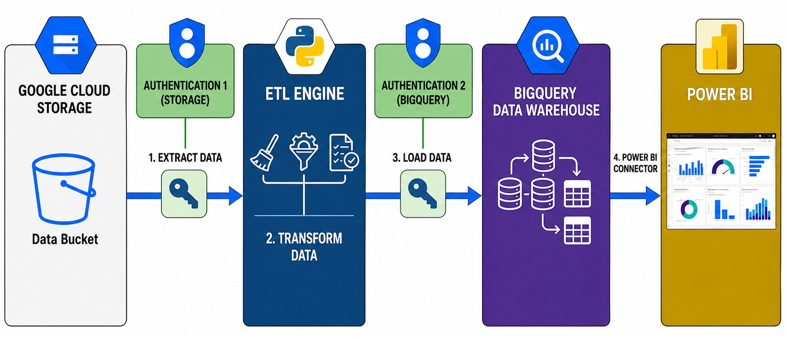
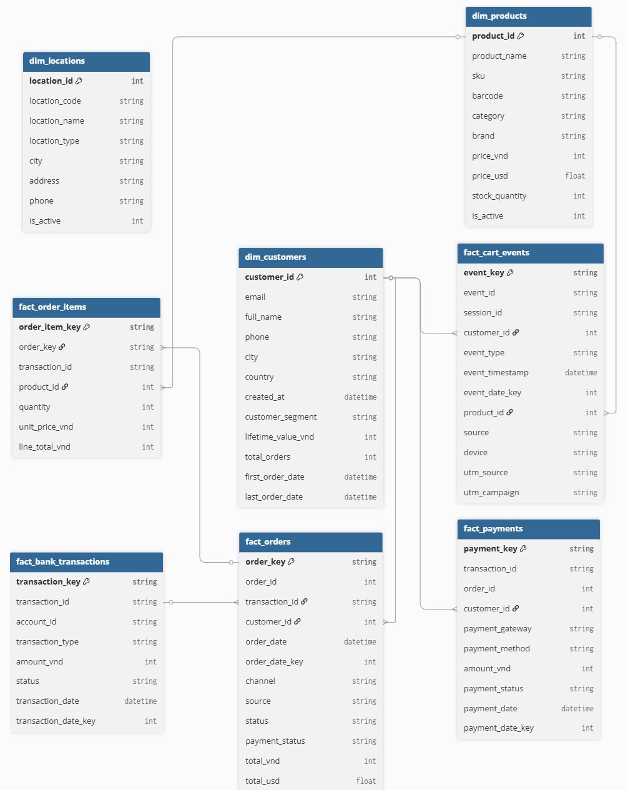
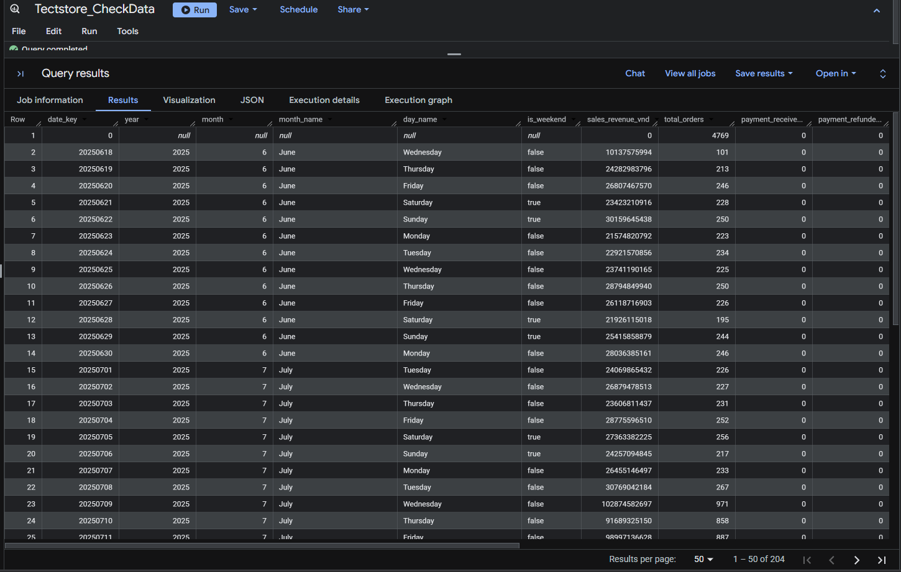
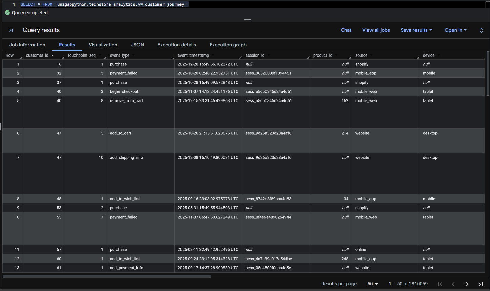
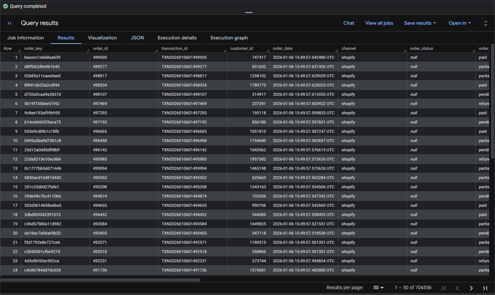
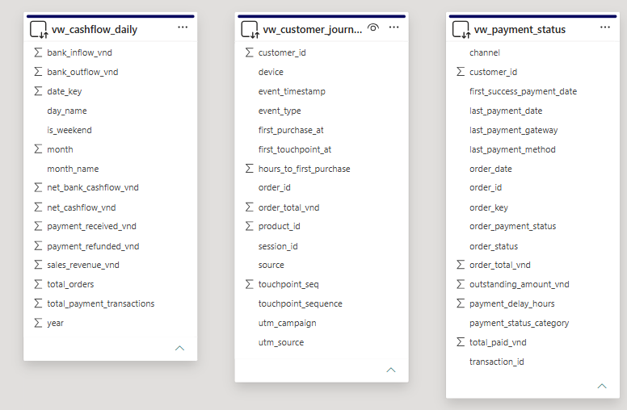

# 🏗️ Python / SQL / Power BI | Building an End-to-end Retail Data Pipeline for Techstore Vietnam


_End-to-end Python ETL pipeline that ingests, cleans, and standardizes multi-channel retail sales and payment gateway data into a partitioned BigQuery Star Schema for unified business intelligence._

- 🎯 **Business Question:** How can we centralize fragmented sales channels and payment data into a single source of truth to track automated customer RFM segmentation, daily cash flows, and order payment health?
- 🏬 **Domain:** Technology Retail & E-commerce
- 🛠️ **Tools:** Python, Google Cloud Storage (GCS), Google BigQuery, Power BI

👤 Author: Bạch Minh Nam

---

## 📑 Table of Contents

1. [📌 Background & Overview](#-background--overview)
2. [📂 Data Sources](#-data-sources)
3. [🏛 Architecture & Design](#-architecture--design)
4. [⚒ Main Process](#-main-process)
5. [🗄 Data Model (Star Schema)](#-data-model-star-schema)
6. [📊 BigQuery Output](#-bigquery-output)
7. [📈 Power BI](#-power-bi)
8. [🔎 Conclusion & Business Impact](#-conclusion--business-impact)
9. [🗂 Project Structure](#-project-structure)
10. [⚙ Setup Instructions](#-setup-instructions)

---

## 📌 Background & Overview

### Business Context

**TechStore Vietnam** is a technology retail company that sells across multiple channels - an online Shopify store, Sapo POS at physical locations, and other online order platforms. Customers pay through MoMo, ZaloPay, PayPal, and Mercury Bank.

Before this project, data from each channel lived in a separate system. There was no single place to see the full picture - how much was sold, whether payments were collected, or how customers behaved across channels.

### What This Project Does

This project builds a **Python ETL pipeline** that pulls data from all sources, cleans and standardises it, and loads it into a **Google BigQuery data warehouse** - so every team works from the same data.

✔️ Connects **8 data sources** (3 sales channels + 4 payment sources + cart tracking) into one place.

✔️ Organises data into a **Star Schema** with 4 active dimension tables and 5 fact tables, ready for analysis.

✔️ Runs **automatic data quality checks** at every step - catching nulls, duplicates, bad dates, and outliers before anything gets loaded.

✔️ After each run, automatically re-calculates **customer RFM segments** and lifetime value using a BigQuery SQL query.

✔️ Creates **3 ready-to-use views** for common business questions: customer journey, daily cashflow, and payment status.

### Who Is This Project For?

✔️ Data engineers looking at pipeline design patterns with GCP

✔️ Analytics engineers who want to see how multi-source ETL is structured in Python

✔️ Business teams who need a reliable, unified view of sales, payments, and customer behaviour

---

## 📂 Data Sources

All raw data is stored in **Google Cloud Storage (GCS)** as `.json.gz` files, one folder per source. The pipeline reads from GCS directly - no extra staging step needed.

| Source | Folder | Data Volume | Format |
|---|---|---|---|
| `Shopify` (Online Store) | `shopify/` | 2M customers · 200K orders · 1K products | `.json.gz` |
| `Sapo POS` (Offline Stores) | `sapo/` | 1M orders · 50 store locations | `.json.gz` |
| `Online Orders` (Multi-channel) | `online_orders/` | 50K orders | `.json.gz` |
| `PayPal` | `paypal/` | 300 transactions | `.json.gz` |
| `MoMo` | `momo/` | 500 transactions | `.json.gz` |
| `ZaloPay` | `zalopay/` | 500 transactions | `.json.gz` |
| `Mercury Bank` | `mercury/` | 3 accounts · 500 transactions | `.json.gz` |
| `Cart Tracking` | `cart_tracking/` | 10,000+ events | `.json.gz` |

### Raw Data Schemas

Each source has its own data format. Below are example:

**Shopify Orders**
```json
{
  "id": "int",
  "transaction_id": "string",
  "customer_id": "int",
  "order_date": "datetime",
  "payment_status": "string",
  "total_vnd": "int",
  "total_usd": "float",
  "line_items": "array",
  "source": "shopify"
}
```

> For full column details on all raw data, see the 📄 [Raw Data Dictionary](raw_data_dictionary.md)

---

## 🏛 Architecture & Design

### Pipeline Architecture



*Figure 1: End-to-End Pipeline - GCS → ETL Engine → BigQuery → Power BI*

| Step | What Happens |
|---|---|
| **1. Extract** | The pipeline connects to GCS using a Storage service account and reads all `.json.gz` files. |
| **2. Transform** | Data is cleaned and reshaped in memory using Python and Pandas. |
| **3. Load** | Cleaned tables are written to BigQuery using a separate BigQuery service account. |
| **4. Visualise** | Power BI connects directly to BigQuery to display dashboards. |

---

## ⚒ Main Process

The pipeline follows a classic **Extract → Transform → Load** flow, extended with a post-load SQL step for customer analytics and a top-level orchestration layer that ties everything together. Each stage is implemented as its own Python module, which keeps the codebase easy to extend, test, and reason about independently.

```
GCS (.json.gz) → Extract → Transform → Load → BigQuery
                                                   │
                                                   ▼
                                     SQL Update (RFM Segmentation)
                                                   │
                                                   ▼
                                            Power BI Dashboards
```

---

### Step 1 — Extract: Pulling Raw Data from GCS

**Purpose.** Every downstream table starts as a raw `.json.gz` file sitting in a GCS bucket, one folder per source (`shopify/`, `sapo/`, `momo/`, `mercury/`, etc.). The extraction layer's only job is to reliably pull that raw data into memory as a Pandas DataFrame — no cleaning, no business logic. Keeping extraction "dumb" makes it easy to swap or add sources without touching anything downstream.

**How it's done.** All extractors inherit from a single `Base_Extractor` class, which centralizes the GCS connection, file listing, and `.json.gz` decompression logic. Each concrete extractor (`Shopify_Extractor`, `Sapo_Extractor`, `Payment_Extractor`, etc.) only needs to know *where its files live* — everything else is reused.

```python
class Base_Extractor:
    """Shared GCS access logic used by every source-specific extractor."""

    def __init__(self, bucket_name: str):
        self.client = storage.Client()
        self.bucket = self.client.bucket(bucket_name)

    def list_files(self, folder_name: str) -> list:
        blobs = self.client.list_blobs(self.bucket, prefix=folder_name)
        return [b.name for b in blobs if not b.name.endswith('/')]

    def extract_json_gz(self, blob_path: str):
        raw_bytes = self.bucket.blob(blob_path).download_as_bytes()
        decompressed = gzip.decompress(raw_bytes)
        return json.loads(decompressed.decode("utf-8"))
```

A concrete extractor becomes a thin, declarative wrapper around this base class:

```python
class Shopify_Extractor(Base_Extractor):
    def extract_file(self) -> pd.DataFrame:
        records = []
        for blob_path in self.list_files('shopify/'):
            data = self.extract_json_gz(blob_path)
            records.extend(data if isinstance(data, list) else [data])
        return pd.DataFrame(records)
```

Payment data is the one exception worth calling out: `Payment_Extractor` serves four different gateways from a single class, and Mercury Bank uniquely returns **two** related tables (`accounts` and `transactions`) instead of one, since bank data needs both to be useful:

```python
def payment_mercury_extract(self) -> dict:
    """Mercury returns 2 linked tables, so the result is a dict, not a single DataFrame."""
    result = {}
    for blob_path in self.list_files('mercury/'):
        df = pd.DataFrame(self.extract_json_gz(blob_path))
        table_name = blob_path.split('/')[-1].replace('.json.gz', '')
        result[table_name] = df
    return result  # {'accounts': df, 'transactions': df}
```

**How it connects to the pipeline.** The orchestrator calls each extractor at the start of `process_dimensions()` and `process_facts()`, and passes the resulting raw DataFrame straight into the corresponding transformer — extraction output *is* transformation input, with no intermediate staging layer.

---

### Step 2 — Transform: Cleaning, Standardizing, and Reshaping

**Purpose.** This is where the actual data engineering happens: reconciling inconsistent schemas across 8 sources, fixing types, generating warehouse-ready keys, and enforcing a consistent shape so that data from Shopify, Sapo POS, and Online Orders can safely live in the same fact table.

**How it's done.** Shared, reusable logic lives in `Base_Transformer`, inherited by both `Dim_Transformer` (slow-changing reference data) and `Fact_Transformer` (transactional events). A few of the most-used utilities:

```python
class Base_Transformer:
    def to_date(self, df, columns: list):
        """Coerces text columns to datetime; invalid values become NaT instead of raising."""
        for col in columns:
            if col in df.columns:
                df[col] = pd.to_datetime(df[col], errors='coerce')
        return df

    def create_surrogate_key(self, df, cols: list, key_name: str):
        """Builds a composite key by joining multiple columns, e.g. 'shopify_1042_TXN88'."""
        key_series = df[cols[0]].astype(str)
        for c in cols[1:]:
            key_series += "_" + df[c].astype(str)
        df[key_name] = key_series
        return df

    def data_quality_check(self, df, table_name, key_columns=None, amount_columns=None):
        """Flags duplicates (soft-delete via is_deleted=1) and detects amount outliers via IQR."""
        df['is_deleted'] = 0
        if key_columns:
            is_dup = df.duplicated(subset=key_columns, keep='first')
            df.loc[is_dup, 'is_deleted'] = 1
        if amount_columns:
            for col in amount_columns:
                q1, q3 = df[col].quantile([0.25, 0.75])
                iqr = q3 - q1
                outliers = df[(df[col] < q1 - 1.5*iqr) | (df[col] > q3 + 1.5*iqr)]
                self.logger.warning(f"'{col}' has {len(outliers)} outliers (IQR method)")
        return df
```

**Dimension tables** (`Dim_Transformer`) are relatively lightweight — mostly column renaming and typing, since customer, product, and location data don't need reconciliation across sources:

```python
def transform_dim_product(self, df):
    col_mapping = {
        'id': 'product_id', 'name': 'product_name', 'sku': 'sku',
        'category': 'category', 'brand': 'brand', 'price_vnd': 'price_vnd'
    }
    df_dim = df[[c for c in col_mapping if c in df.columns]].rename(columns=col_mapping)
    df_dim['is_active'] = 1
    return df_dim
```

**Fact tables** (`Fact_Transformer`) are where the real reconciliation happens. `fact_orders`, for instance, is built from three independently-cleaned channel-specific transforms, then unified with `pd.concat` and cast to a single consistent schema:

```python
def transform_fact_order(self, df_shopify, df_online, df_sapo):
    channels = [
        self.fact_order_shopify(df_shopify),
        self.fact_order_online(df_online),
        self.fact_order_sapo(df_sapo),
    ]
    fact_order = pd.concat(channels, ignore_index=True)

    # Enforce dtypes so BigQuery never rejects the load on schema mismatch
    fact_order['total_vnd'] = fact_order['total_vnd'].fillna(0).astype('int64')
    fact_order['order_date_key'] = fact_order['order_date_key'].fillna(19000101).astype('int32')
    return fact_order
```

Payment data illustrates another recurring challenge: each gateway defines "success" differently, so the transform layer normalizes them into one consistent `payment_status` field before the tables are ever combined:

```python
# ZaloPay marks success with return_code == 1
fact_payment_zalopay['payment_status'] = np.where(df['return_code'] == 1, 'SUCCESS', 'FAILED')

# MoMo marks success with resultCode == 0 — a completely different convention
fact_payment_momo['payment_status'] = np.where(df['resultCode'] == 0, 'SUCCESS', 'FAILED')
```

`fact_order_items` deserves a special mention: each order's `line_items` array is nested JSON, so it has to be exploded into individual product rows using `unflatten_list()`, a thin wrapper around `pd.json_normalize`, before it can be loaded as a relational table.

**How it connects to the pipeline.** Every transform function is called from `process_dimensions()` / `process_facts()` in the orchestrator, immediately after extraction and immediately before `data_quality_check()` and load — transformation is the bridge between "raw JSON" and "trustworthy warehouse table."

---

### Step 3 — Load: Writing to BigQuery

**Purpose.** Get the cleaned DataFrames into BigQuery in a way that's both correct (right schema, right types) and performant (properly partitioned and clustered for the query patterns analysts will actually run).

**How it's done.** A single `Big_Query_Loader` class handles every table in the warehouse. Rather than hardcoding partitioning logic per table, it inspects the target column's dtype and decides automatically between `TimePartitioning` (for real datetime columns) and `RangePartitioning` (for integer date keys like `20240315`):

```python
def load_dataframe(self, df, dataset_id, bq_table_name,
                    write_disposition='WRITE_TRUNCATE',
                    partition_by=None, cluster_by=None):

    job_config = bigquery.LoadJobConfig(write_disposition=write_disposition)

    if partition_by and pd.api.types.is_integer_dtype(df[partition_by]):
        job_config.range_partitioning = bigquery.RangePartitioning(
            field=partition_by,
            range_=bigquery.PartitionRange(start=19000101, end=21001231, interval=1)
        )
    elif partition_by:
        job_config.time_partitioning = bigquery.TimePartitioning(field=partition_by)

    if cluster_by:
        job_config.clustering_fields = cluster_by

    destination = f"{self.client.project}.{dataset_id}.{bq_table_name}"
    job = self.client.load_table_from_dataframe(df, destination, job_config=job_config)
    job.result()
```

In practice, the orchestrator calls this once per table with query patterns in mind — `fact_orders` is clustered on `customer_id` and `channel` because those are the two filters analysts use most often:

```python
self.loader.load_dataframe(
    df=fact_orders,
    dataset_id=self.dataset_id,
    bq_table_name='fact_orders',
    partition_by='order_date_key',
    cluster_by=['customer_id', 'channel'],
)
```

Every table currently loads with `WRITE_TRUNCATE` — a full reload each run — which keeps the loading logic simple while data volume is still manageable; this is the first thing that would move to an incremental/merge strategy as the pipeline scales.

**How it connects to the pipeline.** Load is the final step inside both `process_dimensions()` and `process_facts()` — by the time `load_dataframe()` runs, the data has already passed through cleaning and quality checks, so this step is purely mechanical: get validated data into BigQuery safely.

---

### Step 4 — SQL Update: Customer RFM Segmentation

**Purpose.** Marketing needs each customer's spending behavior classified into actionable segments (VIP, At Risk, Lost, etc.) — but this can only be calculated *after* `fact_orders` is fully loaded, since it depends on aggregating order history across all three sales channels at once. This step closes that loop entirely inside BigQuery, right after the load finishes.

**How it's done.** A single `MERGE` statement, run via `execute_query()`, recomputes and writes the segments back into `dim_customer` in one pass — no separate scoring script, no manual refresh.

```sql
WITH aggregate_value AS (
    SELECT
        customer_id,
        MIN(order_date) AS first_order_date,
        MAX(order_date) AS last_order_date,
        COUNT(DISTINCT order_key) AS total_orders,
        SUM(total_vnd) AS life_time_value_vnd
    FROM fact_orders
    WHERE payment_status IN ('paid', 'partially_paid')
      AND status IN ('completed', 'shipping', 'delivered', 'fulfilled', 'pending')
    GROUP BY customer_id
),

rfm_score AS (
    SELECT
        customer_id,
        CONCAT(
            CAST(NTILE(5) OVER (ORDER BY last_order_date)     AS STRING),
            CAST(NTILE(5) OVER (ORDER BY total_orders)        AS STRING),
            CAST(NTILE(5) OVER (ORDER BY life_time_value_vnd) AS STRING)
        ) AS rfm_cell
    FROM aggregate_value
),

rfm_segment AS (
    SELECT
        customer_id,
        CASE
            WHEN rfm_cell IN ('555','554','544','545', ...) THEN 'VIP / Best Customers'
            WHEN rfm_cell IN ('331','321','312','221', ...) THEN 'At Risk'
            WHEN rfm_cell IN ('155','154','144','214', ...) THEN 'Lost / Inactive'
            ELSE 'Unknown'
        END AS segment
    FROM rfm_score
)

MERGE dim_customer AS target
USING rfm_segment AS source
ON target.customer_id = source.customer_id
WHEN MATCHED THEN
    UPDATE SET target.customer_segment = source.segment;
```

Customers who exist in `dim_customer` but have never placed a qualifying order are handled explicitly rather than silently dropped: a `LEFT JOIN` from `dim_customer` ensures they still appear in the result, defaulted to the `'No Purchase'` segment with `total_orders = 0`.

**How it connects to the pipeline.** This step only runs *after* `process_facts()` completes, since it's the sole consumer of the freshly-loaded `fact_orders` table. It's the pipeline's one piece of "post-load business logic" — everything before it is pure ETL, this step is where raw transactions become an actual customer insight.

---

### Step 5 — Orchestration & Error Handling

**Purpose.** Tie every extractor, transformer, and loader together into one repeatable, observable, fault-tolerant run — and make sure that if one of eight data sources has a bad day, the other seven still make it into the warehouse.

**How it's done.** `Pipeline_Orchestrator` exposes a single entry point, `orchestrator_run()`, that executes the pipeline stages in a strict order:

```python
def orchestrator_run(self):
    self.logger.info(">>> PIPELINE STARTED <<<")
    try:
        self.loader.check_dataset_available(self.dataset_id)
        self.process_dimensions()   # dim_customer, dim_product, dim_location
        self.process_facts()        # fact_orders, fact_order_items, fact_payments, ...
        self.execute_sql_query()    # RFM segmentation MERGE
        self.logger.info(">>> PIPELINE FINISHED SUCCESSFULLY <<<")
    except Exception as e:
        self.logger.critical(f">>> PIPELINE FAILED: {e} <<<")
        raise e
```

Crucially, error handling isn't just wrapped around the whole run — it's applied **per table**, inside `process_dimensions()` and `process_facts()`. A malformed file in `cart_tracking/` should never prevent `dim_customer` from loading:

```python
try:
    self.logger.info("Processing 'dim_customer'...")
    raw = Shopify_Extractor(self.bucket_name).extract_file()
    dim_customer = self.dim_transformer.transform_dim_customer(raw)
    self.dim_transformer.data_quality_check(df=dim_customer, table_name='dim_customer')
    self.loader.load_dataframe(df=dim_customer, dataset_id=self.dataset_id,
                                partition_by='created_at', bq_table_name='dim_customer')
except Exception as e:
    self.logger.critical(f"Fail when processing DIM_CUSTOMER: {e}")
    raise e  # logged and re-raised, but does not block the next table's try/except
```

Every step — success or failure — is logged simultaneously to the console and to `logs/pipeline.log` via a shared `setup_logger()` utility, giving a full audit trail of each run without needing to attach a debugger after the fact.

**How it connects to the pipeline.** This is the layer that turns four independent modules (extract, transform, load, SQL) into an actual product: a single command, `python main.py`, that runs the entire 8-source pipeline end-to-end, self-reports its own health, and degrades gracefully instead of failing all-or-nothing.

---

## 🗄 Data Model (Star Schema)



*Figure 2: Star Schema*

Dimension tables describe the "who", "what", "where", and "when". Fact tables record what actually happened (orders, payments, events) and link back to dimensions via foreign keys.

### Dimension Tables

| Table | Source | Partition | Key Column | What It Contains |
|---|---|---|---|---|
| `dim_customer` | `Shopify` | `created_at` | `customer_id` | Customer profile + RFM segment, lifetime value, etc.. Updated automatically after each pipeline run. |
| `dim_product` | `Shopify` | - | `product_id` | Product name, SKU, category, etc. |
| `dim_location` | `Sapo POS` | - | `location_id` | Store name, code, city, address, phone. `location_type` = `Offline Store`. |
| `dim_date` | - | - | `date_key` | Date attributes: year, quarter, month, etc. |

> `dim_staff` was part of the original scope but **not built** - Sapo POS raw data does not include staff information.

### Fact Tables

| Table | Sources | Partition | Cluster | Primary Key | What It Records |
|---|---|---|---|---|---|
| `fact_orders` | `Shopify` · `Online Orders` · `Sapo POS` | `order_date_key` | `customer_id`, `channel` | `order_key` | Every order across all channels. |
| `fact_order_items` | `Shopify` · `Online Orders` · `Sapo POS` | `order_date_key` | `product_id` | `order_item_key` | Each product line inside an order. |
| `fact_payments` | `ZaloPay` · `MoMo` · `PayPal` | `payment_date_key` | `customer_id`, `payment_gateway` | `payment_key` | Payment transactions from e-wallet gateways. |
| `fact_cart_events` | `Cart Tracking` | `event_date_key` | `customer_id`, `session_id`, `event_type` | `event_key` | User actions on site. |
| `fact_bank_transactions` | `Mercury Bank` | `transaction_date_key` | - | `transaction_key` | Bank-level inflows and outflows. |

### Analytical Views

Three views sit on top of the fact tables and are ready to query directly from Power BI:

| View | Built From | What It Answers |
|---|---|---|
| `vw_customer_journey` | `fact_cart_events` + `fact_orders` | How did each customer move from first interaction to purchase?. |
| `vw_cashflow_daily` | `fact_orders` + `fact_payments` + `fact_bank_transactions` + `dim_date` | What came in and went out each day?. |
| `vw_payment_status` | `fact_orders` + `fact_payments` | Is each order actually paid?. |

tôi muốn các bảng trong phần này dc cho vào kiểu ngta muốn xem thêm ngta bấm vào để xem dc các bảng

> For full column details on all tables, see the 📄 [Data Dictionary](data_dictionary.md)

---

## 📊 BigQuery Output

The screenshots below show real query results from BigQuery after the pipeline has run.

### `dim_customer` - RFM Segments Auto-Updated


`dim_customer` is updated after every pipeline run via the BigQuery MERGE. The table shows each customer's recalculated `lifetime_value_vnd`, `total_orders`, `last_order_date`, and their current RFM segment - including `No Purchase` for customers with no order history (`total_orders = 0` and `first_order_date` / `last_order_date` left as `null`).

### `vw_cashflow_daily` - Daily Revenue and Cashflow



`vw_cashflow_daily` brings together sales, payments, and bank records into one row per day. Finance can check whether revenue was actually collected without joining tables manually.

### `vw_customer_journey` - Touchpoint Sequence Per Customer



`vw_customer_journey` shows each customer's path from first site interaction to purchase - including the full event sequence (e.g. `view_item > add_to_cart > purchase`) and how many hours it took.

### `vw_payment_status` - Payment Health Per Order



`vw_payment_status` joins orders and payments to classify every order's payment health and flag overdue or partially paid orders.

---

## 📈 Power BI

The three analytical views (`vw_customer_journey`, `vw_cashflow_daily`, `vw_payment_status`) are connected to Power BI via the native BigQuery connector for future business reporting.

### Data Model View in Power BI



*Figure 3: The three views loaded into Power BI's model view.*

---

## 🔎 Conclusion & Business Impact

📍 **Key Outcomes:**

✔️ **One place for all data** - sales from Shopify, Sapo POS, and online channels; payments from MoMo, ZaloPay, PayPal, and Mercury; and user behaviour from cart tracking - all cleaned and in one BigQuery dataset.

✔️ **Faster reporting** - the analytics team gets clean, structured tables they can query directly. No more manual exports or fixing mismatched formats before each report.

✔️ **Daily cashflow visibility** - Finance can check whether money was actually received each day with a single query against `vw_cashflow_daily`.

✔️ **Always up-to-date customer segments** - Marketing gets fresh RFM segments automatically after every pipeline run, without a separate tool or manual step.

✔️ **Easy to extend** - adding a new data source only means writing a new extractor class. Everything else (cleaning logic, loader, orchestrator) stays the same.

---

## 🗂 Project Structure

```
ETL Pipeline/
├── config/
│   └── config.txt                    # Configuration template
├── 
│   ├── data_dictionary.md            # Full column-level documentation
│   └── Images/                       # Architecture diagrams and screenshots
├── extractors/
│   ├── __init__.py
│   ├── base_extractor.py             # Shared GCS logic: connect, list files, unzip
│   ├── online_extractor.py           # Online orders (multi-channel)
│   ├── payment_extractor.py          # Mercury, MoMo, PayPal, ZaloPay
│   ├── sapo_extractor.py             # Sapo POS offline orders
│   ├── shopify_extractor.py          # Shopify online store
│   └── tracking_extractor.py         # Cart tracking events
├── loaders/
│   ├── __init__.py
│   └── bigquery_loader.py            # Writes to BigQuery with partitioning and clustering
├── orchestration/
│   ├── __init__.py
│   └── pipeline_orchestrator.py      # Runs the full pipeline in order
├── transformers/
│   ├── __init__.py
│   ├── base_transformer.py           # Shared cleaning, key generation, quality checks
│   ├── dimension_transformer.py      # Builds dim_customer, dim_product, dim_location
│   └── fact_transformer.py           # Builds all five fact tables
├── utils/
│   ├── __init__.py
│   ├── config.py                     # Loads environment variables and credential paths
│   └── logger.py                     # Logs to both console and file
├── tests/
│   ├── check_data.py
│   ├── test_extract.py
│   ├── test_load.py
│   └── test_transform.py
├── logs/                             # Pipeline run logs (auto-created)
├── .env.example                      # Example environment config
├── main.py                           # Entry point - run this to start the pipeline
└── requirement.txt                   # Python dependencies
```

---

## ⚙ Setup Instructions

### What You Need

- Python 3.8 or higher
- A Google Cloud account with BigQuery and Cloud Storage enabled
- A service account with **BigQuery Admin** and **Storage Object Viewer** permissions

### Steps

**1. Clone the repo**
```bash
https://github.com/TascoGitGud/Building-an-End-to-end-Retail-Data-Pipeline-for-Techstore-Vietnam.git
```
**2. Install dependencies**
```bash
pip install -r requirement.txt
```

**3. Set up credentials**

Fill in your GCP credential file paths:

```env
GOOGLE_APPLICATION_CREDENTIALS=path/to/gcs_service_account.json
GOOGLE_APPLICATION_CREDENTIALS_BIGQUERY=path/to/bigquery_service_account.json
```

> GCP credentials are not included in this repo for security reasons.

**4. Set your bucket and dataset**

In `main.py`, update these two lines:
```python
BUCKET_NAME = 'your-gcs-bucket-name'
DATASET_ID = 'your-dataset'
```

**5. Run the pipeline**
```bash
python main.py
```

The pipeline will log every step to the console and to `logs/pipeline.log`. When it finishes, all tables and views will be available in BigQuery under the dataset you configured.


---

